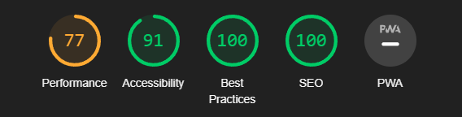
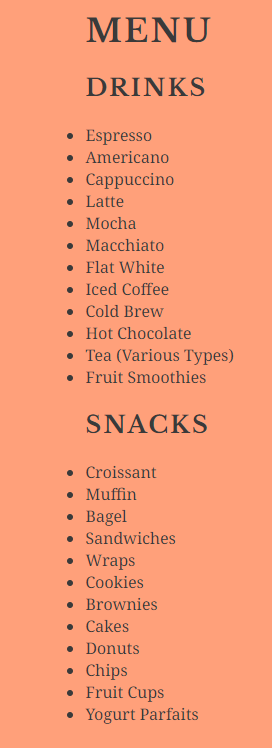
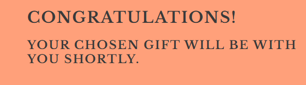

# One Dice
[One Dice](https://pumpkinpoem.github.io/Dice/index.html) is a geek cafe where you can play tabletop games and enjoy amazing beverages. We aim to create a cozy atmosphere and great vibes. You can bring your own games or borrow laminated copies from the staff. We also host movie nights and livestream Critical Role every Monday.

[View Responsive Mockup Live](https://ui.dev/amiresponsive?url=https://pumpkinpoem.github.io/Dice/index.html)

## Existing Features

- **Navigation Bar:**
  - Featured on all pages, the fully responsive navigation bar includes links to the Home page and Sign Up page. It is consistent across all pages to ensure easy navigation.
  - This section enables users to navigate seamlessly across all devices without needing to rely on the back button.

- **Landing Page Image:**
  - The landing page includes a captivating photograph with text overlay, providing users with a clear idea of the cafe's ambiance.
  - This section introduces users to One Dice with an attention-grabbing image.

- **Welcome Section:**
  - The Welcome section contains general information and motivates visitors to explore the cafe further.

- **Menu Section:**
  - The menu section lists the available menu items, including drinks and snacks.

- **Sign Up Page:**
  - Allows users to sign up for One Dice's email list and choose a welcome gift from two options of dice sets.

- **Confirmation Page:**
  - Displays a confirmation message when users successfully submit their information on the sign-up form.

- **Footer:**
  - The footer section includes links to One Dice's social media profiles, allowing users to connect with the cafe on various platforms.

## Features Left to Implement

- Gallery page for live events and a quiz form for entertainment.

## Testing 

- Admin Tools: Reviewed the code using Admin Tools to ensure functionality on both the test site and deployed site.
- Cross-Browser Compatibility Testing: Tested the code on various web browsers to ensure compatibility and consistent performance.
- Responsive Design Testing: Checked the responsiveness of the website on different devices to ensure proper rendering and usability.
- User Experience Testing: Conducted usability testing to evaluate navigation, interaction flow, and accessibility features.

### Functional Testing

| Action               | Expected Behavior                 | Pass/Fail |
|----------------------|----------------------------------|-----------|
| Click Landing Page   | Landing page loads                | Pass      |
| Click Home Nav Icon  | Landing page loads                | Pass      |
| Click Menu Nav Icon  | Menu page loads                   | Pass      |
| Click Signup Nav Icon| Signup page loads                 | Pass      |
| Click Social Icons   | Corresponding social media loads  | Pass      |
| Signup with Valid Info| Confirmation page loads         | Pass      |

### Validator Testing 

- HTML: index
  - No errors were found when passing through the official [W3C validator](https://validator.w3.org/nu/?doc=https%3A%2F%2Fpumpkinpoem.github.io%2FDice%2F).

- HTML: menu
  - No errors were found when passing through the official [W3C validator](https://validator.w3.org/nu/?doc=https%3A%2F%2Fpumpkinpoem.github.io%2FDice%2Fmenu.html).

- HTML: Signup
  - No errors were found when passing through the official [W3C validator](https://validator.w3.org/nu/?doc=https%3A%2F%2Fpumpkinpoem.github.io%2FDice%2Fsignup.html).

- HTML: Signup confirmation
  - No errors were found when passing through the official [W3C validator](https://validator.w3.org/nu/?doc=https%3A%2F%2Fpumpkinpoem.github.io%2FDice%2Fconfirmation.html%3Ffirst_name%3Dtest%26last_name%3Dtest%26email_address%3Dtest%2540test.test%26sign-up-gift%3Ddice).

- CSS:
  - No errors were found when passing through the official [(Jigsaw) validator](http://jigsaw.w3.org/css-validator/validator?lang=en&profile=css3svg&uri=https%3A%2F%2Fpumpkinpoem.github.io%2FDice%2Findex.html&usermedium=all&vextwarning=&warning=1).

### Unfixed Bugs

- The issue with white lines on the Welcome section remains unresolved. Attempts to fix it were unsuccessful.

## Deployment 

- The site was deployed to GitHub Pages by selecting the Master Branch from the GitHub repository's Settings tab.
- To clone the repository, use the command `git clone [repository_url]` in the command line.

[Live Deployment Link](https://github.com/Pumpkinpoem/Dice/deployments)

## Credits 

- Code cleanup and adjustments were done with assistance from ChatGPT.
- Spelling and grammar fixes were done with ChatGPT and Lana Kohut.
- Readme Template adapted from Code Institute's template.

### Content 

- Navigation bar, Sign Up page, and footer sections were adapted from the Love Running course.
- Icons sourced from [Font Awesome](https://fontawesome.com/).
- Fonts used: Noto Serif and Libre Baskerville from [Google Fonts](https://fonts.google.com).

### Media

- Home and sign-up page photos sourced from Unsplash.
- Favicons obtained from [Favicons.io](https://favicon.io/emoji-favicons/crossed-swords/).