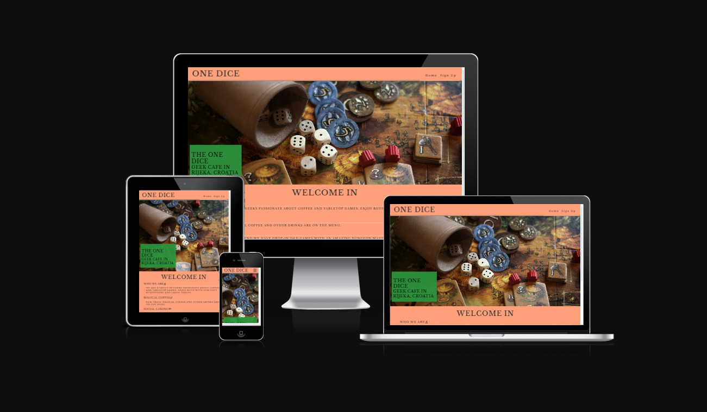
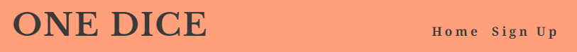
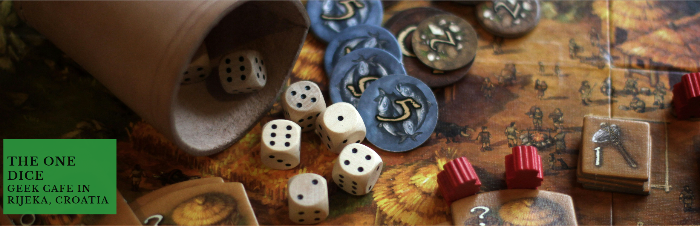
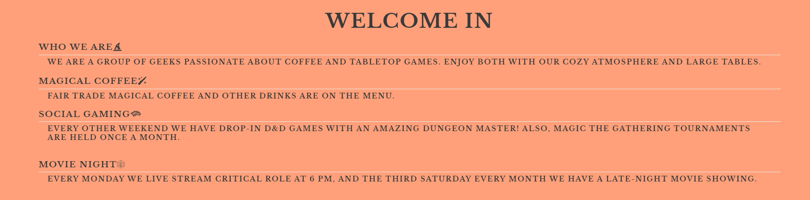
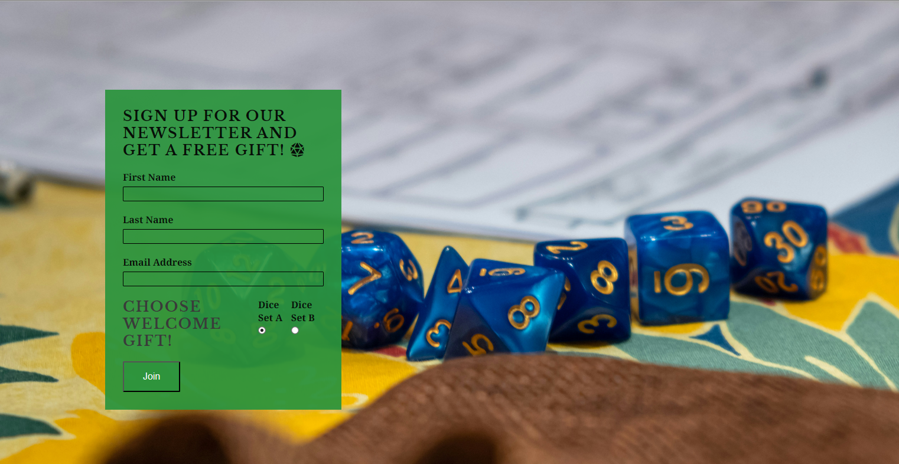

# One Dice

One Dice is a geek cafe where you can play tabletop games and drink amazing beverages. We strive to create a cozy atmosphere and great vibes. You can bring your own games or borrow laminated copies from the staff. We also host movie nights and livestream Critical Role every Monday.

### Existing Features

- __Navigation Bar__

  - Featured on both pages, the fully responsive navigation bar includes links to the Home page and Sign Up page. It is identical on each page to allow for easy navigation.
  - This section allows users to navigate easily across all devices without having to revert back to the previous page via the back button. 

- __Landing Page Image__

  - The landing page includes a photograph with text overlay to allow users to see exactly which location this site would be applicable to. 
  - This section introduces users to One Dice with an eye-catching picture to grab their attention.

- __Welcome Section__

  - The Welcome section holds general information and motivates people to visit the cafe.

- __Footer__ 

  - The footer section includes links to the relevant social media sites for One Dice. The links will open in a new tab to allow easy navigation for users. 

- __Sign Up Page__

  - This page allows users to sign up for One Dice's email list. For first-time registration, users can choose one of two dice sets as a welcome gift.

### Features Left to Implement

- Gallery page for live events and a quiz form for fun.

## Testing 

- Admin Tools: I used Admin tools to review the code and ensure that it was working as intended on both the test site and the deployed site.
- Cross-Browser Compatibility Testing: I tested the code on various web browsers (e.g., Chrome, Firefox, Safari, Edge) to ensure compatibility and consistent performance across different platforms.
- Responsive Design Testing: I checked the responsiveness of the website by testing it on different devices (desktop, tablet, mobile) to ensure proper rendering and usability across various screen sizes.
- User Experience Testing: I conducted usability testing to evaluate the overall user experience, including navigation, interaction flow, and accessibility features.

### Validator Testing 

- HTML:
  - One error was returned when passing through the official [W3C validator](https://validator.w3.org/nu/?doc=https%3A%2F%2Fpumpkinpoem.github.io%2FDice%2Fsignup.html).
- CSS:
  - No errors were found when passing through the official [(Jigsaw) validator](http://jigsaw.w3.org/css-validator/validator?lang=en&profile=css3svg&uri=https%3A%2F%2Fpumpkinpoem.github.io%2FDice%2Findex.html&usermedium=all&vextwarning=&warning=1).

### Unfixed Bugs

- I have not fixed the validator error for the Alt text.
- The white lines on the Welcome section are supposed to be black, but when I make them black, white still shows, and I didn't manage to fix it.

## Deployment 

- The site was deployed to GitHub Pages. The steps to deploy are as follows: 
  - In the GitHub repository, navigate to the Settings tab. 
  - From the source section drop-down menu, select the Master Branch.
  - Once the master branch has been selected, the page will be automatically refreshed with a detailed ribbon display to indicate the successful deployment. 

The live link can be found [here](https://github.com/Pumpkinpoem/Dice/deployments).

## Credits 

- Help with cleaning and adjusting the code was done with ChatGPT.
- Spelling and grammar fixes were done with ChatGPT and Lana Kohut.
- Readme Template taken from Code institute Readme Template.

### Content 

- The toggled nav hamburger button was taken from the Love Running course.
- The Sign Up page was taken from the Love Running code course.
- The footer section was taken from the Love Running course.
- The icons were taken from [Font Awesome](https://fontawesome.com/).
- The fonts used were taken from [Google Fonts](https://fonts.google.com): Noto Serif and Libre Baskerville.

### Media

- The photos used on the home and sign-up page are from Unsplash.
- The favicons were taken from [Favicons.io](https://favicon.io/emoji-favicons/crossed-swords/).
